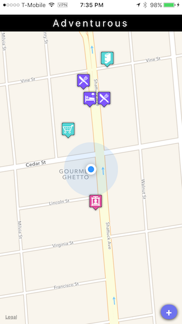

# Adventurous

Adventurous is a location-aware iOS mobile and web app for travelers to recommend local activities to friends.

## Team

**Product Owner**: Jenna Vuong

**Lead Developer**: Andrew Lloyd

**Scrum Master**: Tritia Timmins

## Table of Contents

1. Tech Stack
2. Installing Dependencies
3. Contributing

## Installing Dependencies

    npm install
    
to start with webpack-dev-server (port 8080):

    npm start

to start with express server (PORT optional, defaults to 3000):

    mongod (start in a separate terminal)
    
    PORT=4568 NODE_ENV=production npm start

to view:

    browse to localhost + port (e.g. localhost:8080 etc.)

## Tech Stack:

    React
    React Router
    Webpack
    Web Fonts
    Express
    Mongoose (ORM)
    MongoDB (mlab)
    Axios
    deployed on Heroku
    React Native
    mobile device: geoloc, react-native-camera
    Bootstrap
    (planned) - Mocha/Chai
    (probably) - Less
    (maybe) - server-side rendering
